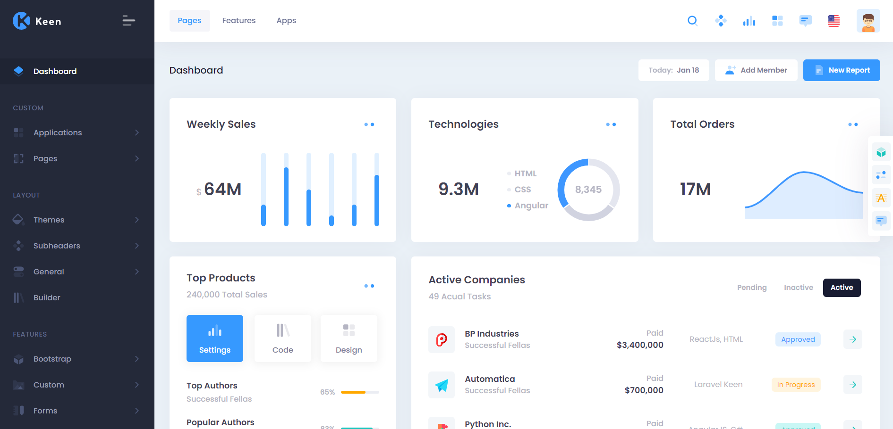
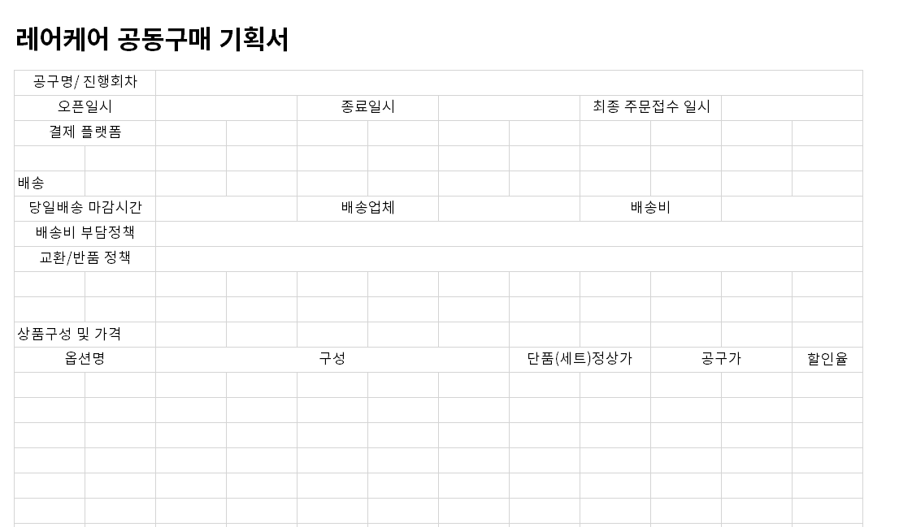

### ■ 프로젝트 주제 고민

- 동료 개발자들 앞에서 하는 프로젝트인데 뽀대도 나야 할 거 같고...
- 재미도 있어야 하고...
- 이왕 하는 거 돈도 됐으면 좋겠고...
- 연봉 협상 시즌이라 회사에 잘 보여야 하는데...
- 기간내에 개발은 가능한 프로젝트인지...
- 친구랑도 뭐 하기로 했는데...

Contents Management System(CMS) for 금융상품

금융상품 추천 ML API

Slack Backup

유아용품 보관, 공유, 대여

...

# Rarecare Admin

Rarecare Admin은 (주)레어케어(https://smartstore.naver.com/) 의 내부 관리용 시스템이다.

- Javascript, Spring Boot, Mysql

- UI - https://keenthemes.com 

### 1. 공동구매 기획서 시스템화 및 Excel 출력

Excel로 수기 관리하던 공동구매 기획서를 시스템화 및 협력사 공유용 Excel로 부분 출력

### 2. 평판 모니터링

키워드별 평판 모니터링
